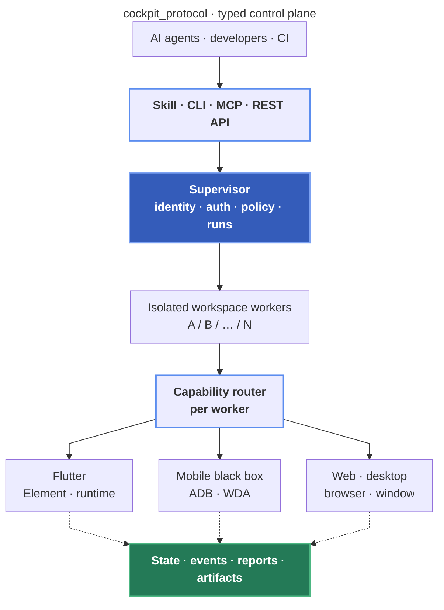

<div align="center">
  <a href="https://github.com/cockpit-dev/cockpit">
    
  </a>
  <h1>Cockpit</h1>
  <p><strong>One control plane for Flutter development and black-box application E2E.</strong></p>
  <p>
    <a href="https://github.com/cockpit-dev/cockpit/actions/workflows/example-e2e.yml"></a>
    <a href="https://github.com/cockpit-dev/cockpit/blob/main/LICENSE"></a>
  </p>
  <p>
    <a href="https://pub.dev/packages/cockpit"></a>
    <a href="https://pub.dev/packages/flutter_cockpit"></a>
    <a href="https://pub.dev/packages/cockpit_protocol"></a>
  </p>
  <p>
    <a href="https://dart.dev"></a>
    <a href="https://flutter.dev"></a>
    <a href="https://github.com/cockpit-dev/cockpit#black-box-targets"></a>
  </p>
  <p><a href="README.md">English</a> · <a href="README.zh-CN.md">简体中文</a></p>
</div>

Cockpit is a production application development, E2E automation, and
verification stack for AI and CI. Flutter source development uses a first-class
managed adapter with structured widget, route, log, error, network, and runtime
state. Independently, installed Android and iOS applications can be controlled
and verified as non-invasive black boxes. Both paths expose the same typed
resources to CLI, MCP, and future clients without conflating their roles.

It provides:

- standalone LON, JSON, or YAML cases and suites;
- semantic, native accessibility, system, visual, and coordinate planes;
- target discovery, registration, launch, inspection, and capability truth;
- dependency DAGs, fixtures, matrices, retries, bounded concurrency, and
  fail-fast suites;
- durable run events, restart-safe suite checkpoints, exact session affinity,
  cancellation, artifacts, and complete offline regression report bundles;
- a per-user authenticated Supervisor with isolated per-workspace workers;
- resource-oriented CLI, HTTP/SSE API, and MCP clients without a bundled GUI.

## Packages

- [`cockpit_protocol`](packages/cockpit_protocol) owns platform-neutral DTOs,
  the test DSL, JSON Schema, and OpenAPI contract.
- [`cockpit`](packages/cockpit) owns the Supervisor, workspace workers, drivers,
  CLI, MCP server, reports, and artifacts.
- [`flutter_cockpit`](packages/flutter_cockpit) is the first-class in-app
  Flutter development, inspection, and control adapter. Pure black-box users
  do not need it.

Minimum versions are Dart 3.8.0 and Flutter 3.32.0. Install the host CLI once:

```bash
dart pub global activate cockpit any
cockpit --help
```

Upgrade the installed runtime with one command:

```bash
cockpit update
```

It updates the CLI and running Supervisor to the latest verified Pub release
while preserving local authorization and durable state.

Flutter source development additionally uses the development-only bridge:

```yaml
dev_dependencies:
  flutter_cockpit: any
```

Keep Cockpit development-only. Native black-box testing does not require an
application source dependency or a Flutter integration.
Do not add `flutter_cockpit` imports to production `lib/` code.

## Install For AI Agents

The repository-owned Skill and complete host integration guide live at
[`skills/cockpit`](skills/cockpit).

Preferred: ask the current AI host to install the CLI, Skill, native adapter,
and MCP surface for you. Copy this prompt:

```text
Install Cockpit for the current AI host, including the CLI, complete cockpit Skill, native adapter, and cockpit_mcp when supported, by following https://github.com/cockpit-dev/cockpit/blob/main/skills/cockpit/INSTALL.md
```

Complete host-specific installation and verification instructions live in
[`skills/cockpit/INSTALL.md`](skills/cockpit/INSTALL.md). Native adapter and MCP
details are documented in the [agent integration guide](docs/agent-integrations.md).

## Flutter Fast Path

Run from the intended Flutter project. `dev` discovers and owns the workspace,
target, process, port, and bridge, then reuses that project's active numeric
handle while checkout identity keeps concurrent projects isolated:

```bash
cockpit dev start cockpit/main.dart --platform macos
cockpit dev status
cockpit dev inspect "Save"
cockpit dev tree
cockpit dev tap "Save"
cockpit dev open "myapp://tasks/42"
cockpit dev wait
cockpit dev screenshot
cockpit dev reload
cockpit dev diagnose --view more
```

Omit the entrypoint and platform when Cockpit can infer them. Normal commands
also omit the current handle, LON format, brief view, and operation
timeout. `dev` automatically runs its local Supervisor in process-scoped yolo
mode; strict policy remains available for black-box, CI, staging, and
production workflows. Cockpit does not read a keychain or secret store, and
`--env` values are process-only.

Flutter inspection walks the mounted Element and RenderObject structure; it
does not require application-authored `Semantics` labels. Use the bounded
`dev inspect QUERY` result for normal work; its `sel` is directly executable,
multiple conditions intersect, and stable ancestor scopes are preferred over
widget paths. `dev tree` returns a compact selector index.
Escalate to `dev tree --view more` or `dev tree --view full` only when the
surrounding structure is needed; both write the tree to an artifact and stdout
returns only its verified path.
Use `dev open URI` to test a custom deep link, Android app link, iOS universal
link, or HTTP(S) URL through the selected target, then verify the expected route
or anchor with `dev wait` and `dev inspect`.

## Runtime Model

`cockpit` commands discover or start one daemon under `COCKPIT_HOME`. The daemon
owns authentication, workspace identity, authorization, admissions, leases,
ports, run projections, and artifacts. It starts an isolated worker for each
active workspace and engine version. No command relies on a global "latest"
project or session.



Register multiple projects once, then address them explicitly or run a command
from inside exactly one registered workspace:

```bash
cockpit daemon start
cockpit root add --path /work/projects --label projects
cockpit workspace register --root-id <rootId> --path /work/projects/app-a
cockpit workspace register --root-id <rootId> --path /work/projects/app-b
cockpit workspace list
```

## CLI Output

The default is brief canonical LON. Use `--view more` for additional context and
`--view full` for the complete response. `--format` supports
`lon|json|yaml|jsonl|path|none`; JSON is intended for `jq`, JSON-only consumers,
and wire inspection. `--output` and artifact commands return the verified output
path.

## Authorization

Dangerous operations and test safety effects are denied unless explicitly
authorized. Persist policy under `COCKPIT_HOME/authorization.json`; validate and
apply it through the CLI. A running daemon must be restarted so one process
cannot change authority mid-run.

```json
{
  "schemaVersion": "cockpit.supervisor.authorization/v2",
  "allowedDangerousOperations": [
    "app.launch",
    "app.restart",
    "app.stop",
    "command.batch",
    "command.run",
    "evidence.screenshot.capture",
    "lease.recover",
    "recording.start",
    "recording.stop",
    "system.action",
    "target.launch"
  ],
  "allowedOperationSafetyEffects": [
    "capture",
    "externalSideEffect",
    "permission",
    "recording",
    "reset",
    "system"
  ],
  "allowedTargetEnvironments": [
    "development",
    "test",
    "production"
  ],
  "allowedSafetyEffects": [
    "communication",
    "credentialSensitive",
    "destructive",
    "externalNavigation",
    "financial",
    "permissionChange"
  ]
}
```

```bash
cockpit daemon policy validate --file authorization.json
cockpit daemon policy apply --file authorization.json --restart
cockpit daemon policy show
```

For an explicitly unrestricted local session, start the Supervisor with
`cockpit daemon start --yolo` (or `daemon restart --yolo`). YOLO
applies only to that daemon process. An unflagged start or restart preserves a
healthy running daemon's current mode; when no daemon is running, it starts with
the persisted restricted policy. Stop first when an explicit return to
restricted mode is required. `daemon status`, attempt manifests, and suite
`report.json` record the effective `auth`.

A policy may explicitly authorize `production` or `unknown`; the default
policy does not.
Quarantined leases remain blocked until verified cleanup succeeds. The
Supervisor advertises `lease.list` and the `reset`-authorized `lease.recover`
operation for exact lease/workspace/resource/holder identities. An explicit
`forceRelease: true` may release an unverified logical resource; forwarded
ports always require verified cleanup and can never be force released.

## Black-Box Targets

Register an installed application without changing its source:

```bash
cockpit target register \
  --workspace-id <workspaceId> \
  --platform android \
  --device-id emulator-5554 \
  --target-kind nativeApp \
  --app-id com.example.app \
  --environment test \
  --mode automation \
  --idempotency-key android-target-001

cockpit target launch --workspace-id <workspaceId> --target-id <targetId> \
  --idempotency-key android-launch-001
cockpit target inspect --workspace-id <workspaceId> --target-id <targetId>
```

Android uses ADB and native accessibility. iOS Simulator uses `simctl`; native
iOS UI interaction uses a reachable WebDriverAgent endpoint. Physical iOS
installation and lifecycle use `devicectl` where available. Cockpit reports
unsupported or unavailable capabilities explicitly.

For an installed Flutter app or a native app embedding Flutter, register
`targetKind: flutterApp` with an `appId` and no entrypoint, then author the case
on the `native` plane. Cockpit launches it through system control and drives the
complete native accessibility tree without an application dependency. The
Flutter-aware resolver locally collapses duplicate ancestor semantics and
prefers actionable matches while leaving native screens, platform views,
WebViews, and distinct list rows intact. Use an entrypoint-backed Flutter target
and the `semantic` plane only when the optional development bridge is required.

Flutter targets accept a structured launch configuration across CLI, MCP, and
`op run`. Cockpit owns the entrypoint, device, mode, flavor, and remote
control flags; callers can supply repeatable dart defines, define files,
additional safe Flutter arguments, process environment values, and a launch
budget up to 30 minutes:

```bash
cockpit target launch \
  --workspace-id <workspaceId> \
  --target-id <flutterTargetId> \
  --dart-define API_URL=https://api.example.test \
  --dart-define-from-file config/staging.json \
  --env LOG_LEVEL=debug \
  --flutter-arg=--track-widget-creation \
  --timeout 30m \
  --idempotency-key flutter-launch-001
```

The equivalent operation input uses a `launchConfiguration` object with
`dartDefines`, `dartDefineFromFiles`, `flutterArgs`, and `environment`. Launch
configuration values are not returned in operation output. Do not pass Flutter
launch fields to installed black-box targets.
On Android and iOS, `environment` configures the Flutter build process; mobile
application processes do not inherit arbitrary host variables. Use Dart defines
or an application-owned configuration channel for values the app must read.

Every advertised operation includes `executionMode`, `defaultTimeoutMs`, and
`maximumTimeoutMs`. Synchronous operations block until their result and accept
one `op run --timeout <duration>` override such as `90s` or `20m`.
Case and suite runs are durable jobs: submission returns a `runId` immediately,
then clients consume events and the terminal report. `case run --timeout`
defaults to 30 minutes and allows up to 6 hours; `suite run --timeout`
defaults to 2 hours and allows up to 24 hours. Step and cleanup timeouts remain
independent inner budgets.

Each step may explicitly select `semantic`, `native`, `visual`, or `coordinate`
with `plane`. Without an override, Cockpit routes screenshot assertions to the
visual plane, system and location-travel actions to native control, visual and
coordinate locators to their matching planes, and native-only constraints to
native accessibility. Other steps inherit the case plane. An entrypoint-backed
Flutter session keeps the semantic driver and a secondary system driver for the
same app/device, so one case can inspect Widgets and then cross a native screen,
platform view, permission dialog, or visual-only surface without changing the
application under test.
The secondary capability profile is available as `system` from
`cockpit target inspect`.

The shared action vocabulary includes `copyText`, `eraseText`, `pasteText`, and
bounded `travel` routes in addition to gestures, editing, keyboard, wait,
assertion, capture, recording, and system actions. Visual locators use a
workspace-confined image file and an optional similarity threshold.
`assertScreenshot` compares a live capture with a workspace-confined baseline
and records actual, baseline, and diff artifacts. Select baselines by a stable
visual profile such as platform, device or viewport, pixel ratio, and orientation.
A dimension mismatch is a profile mismatch or layout regression.

## Cases And Suites

Cases and suites use `schemaVersion: cockpit.test/v2`. Validate documents before
submitting them, and use stable idempotency keys for replay:

```bash
cockpit case validate --workspace-id <workspaceId> --file cases/login.yaml
cockpit case run --file cases/login.yaml \
  --idempotency-key login-local-2026-07-24
cockpit case run --workspace-id <workspaceId> \
  --document-id <documentId> --case-id login \
  --idempotency-key login-2026-07-24 \
  --timeout 30m

cockpit suite validate --workspace-id <workspaceId> --file suites/regression.yaml
cockpit suite run --file suites/regression.yaml \
  --idempotency-key regression-local-2026-07-24
cockpit suite run --workspace-id <workspaceId> \
  --document-id <documentId> --suite-id regression \
  --idempotency-key regression-2026-07-24
cockpit suite report --run-id <runId> \
  --output-dir cockpit-report
```

The `--file` form validates and submits one local document directly. Use the
indexed ID form for a durable shared or CI document; the two forms are mutually
exclusive.

After worker termination, completed nodes stay complete, an active attempt
becomes `interrupted`, and the suite continues only when its retry policy allows
it. Persisted fixture and row bindings must resolve to the same healthy session;
Cockpit fails explicitly when that session can no longer be proven.

Lifecycle composition uses the smallest existing scope: suite fixtures for
campaign or attempt setup/teardown, case `setup`/`finally` for case ownership,
step `evidence` for before/after/failure capture policy, and explicit
`startRecording`/`stopRecording` steps around the exact interval that needs
video. `if`, bounded `retry`/`loop`, and fragments compose normally inside
these scopes.

Every finalized suite publishes one portable report bundle. Export it with
`suite report --output-dir cockpit-report`; the CLI downloads only the files
declared by the run manifest, verifies their metadata and SHA-256 while
downloading, and commits the directory only after the bundle is complete. The
destination must not already exist. Open
`index.html` offline to move from release summary and coverage through
executions, evidence, diagnostics, and environment/files. Search, filters,
deep links, and responsive/print layouts work without a server or network.
`report.json` is the canonical single-file fact graph containing suite
and case definitions, attempts, detailed steps, assertions, and evidence
references. `manifest.json` declares every other file with semantic ownership,
size, media type, and SHA-256. `summary.md`, `junit.xml`, `run/events.jsonl`,
semantic case directories, screenshots, recordings, logs, and snapshots are
derived portable views of the same facts. Clients must preserve relative paths
and verify the manifest before trusting any file.

## MCP And Clients

Start the MCP stdio client with either command:

```bash
cockpit serve-mcp
cockpit_mcp
cockpit serve-mcp --profile dart
```

MCP is a thin authenticated Supervisor client. It does not construct drivers or
application services in-process. It exposes bounded roots, workspaces,
operations, targets, documents, cases, suites, runs, and artifacts. Official
and third-party GUI clients should use `/api/v2`, authenticated SSE run events,
public foundation DTOs, and digest-checked artifact downloads.

REST is the complete public command/resource control plane. Discover global and
workspace operation descriptors, read their exact contracts from
`GET /api/v2/operations/schema`, and execute them through the matching global or
workspace operation POST route. Authenticated SSE is the durable resumable run
event stream. WebSocket is only an internal Flutter Web bridge transport, not a
third-party command protocol; captured app WebSocket frames remain available as
network evidence.

The default `core` profile keeps the control plane small. Optional profiles are
`dart`, `flutter` (`dart` plus Flutter), `app`, `e2e` (`app` plus E2E), and
`all`; `--enable <name>` and `--disable <name>` provide exact overrides. The
Dart profile supplies analyze, format, fix, test, LSP, pub, package URI/search,
and project creation tools through the same workspace-isolated Supervisor. It
is a complete Cockpit-side alternative when the official Dart MCP server is not
installed; Cockpit neither embeds nor proxies that server.

Agent host setup for Codex, Claude Code, Cursor, Gemini CLI, Kiro, OpenCode,
GitHub Copilot, Windsurf, Cline, Roo Code, Pi, and Oh My Pi is documented in
the [agent integration guide](docs/agent-integrations.md).

## Foreground CI

Foreground mode owns an isolated daemon, registers one checkout, submits a
`CockpitRunSubmission`, waits for terminal truth, and exits from the run outcome:

```bash
cockpitd \
  --home=/tmp/cockpit-ci \
  --foreground-workspace=/workspace/app \
  --foreground-submission=/workspace/run-submission.json
```

## Source Development

When changing the CLI, daemon, or worker in this repository, install the
self-contained AOT executable once before live validation:

```bash
dart run tool/install_cockpit.dart
```

The installer builds and verifies the AOT executable, then places it in Dart's
global bin directory. Use `--output PATH` to select another destination.

## Documentation

Detailed package and protocol documentation:

- [`packages/cockpit/README.md`](packages/cockpit/README.md)
- [`packages/flutter_cockpit/README.md`](packages/flutter_cockpit/README.md)
- [`packages/cockpit_protocol/README.md`](packages/cockpit_protocol/README.md)
- [`docs/agent-integrations.md`](docs/agent-integrations.md)
- [`skills/cockpit/references/environments.md`](skills/cockpit/references/environments.md)
