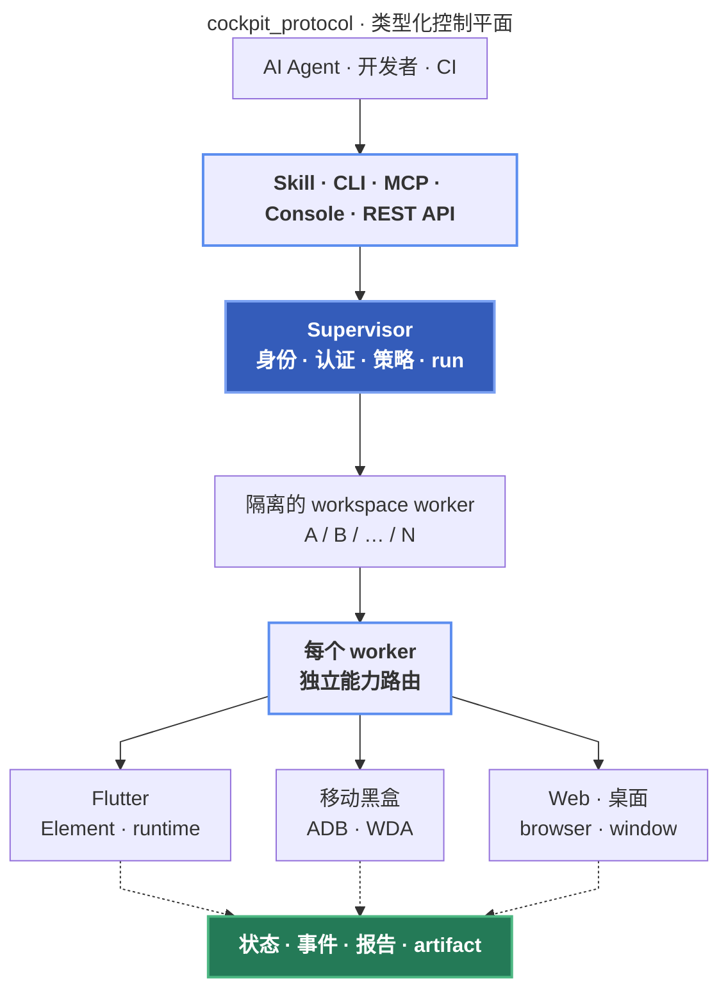

<div align="center">
  <a href="https://github.com/cockpit-dev/cockpit">
    
  </a>
  <h1>Cockpit</h1>
  <p><strong>统一完成 Flutter 快速开发验证与任意应用黑盒 E2E。</strong></p>
  <p>
    <a href="https://github.com/cockpit-dev/cockpit/actions/workflows/example-e2e.yml"></a>
    <a href="https://github.com/cockpit-dev/cockpit/blob/main/LICENSE"></a>
  </p>
  <p>
    <a href="https://pub.dev/packages/cockpit"></a>
    <a href="https://pub.dev/packages/flutter_cockpit"></a>
    <a href="https://pub.dev/packages/cockpit_protocol"></a>
  </p>
  <p>
    <a href="https://dart.dev"></a>
    <a href="https://flutter.dev"></a>
    <a href="https://github.com/cockpit-dev/cockpit#black-box-targets"></a>
  </p>
  <p><a href="README.md">English</a> · <a href="README.zh-CN.md">简体中文</a></p>
</div>

Cockpit 是面向 AI 与 CI 的生产级应用开发、E2E 自动化与验证框架。Flutter 源码
开发使用一等受管适配器，直接获得 widget、route、log、error、network 与 runtime
结构化状态；已安装的移动端与桌面端应用，以及显式注册的浏览器页面，也可以独立做
无侵入黑盒操控与验证。两条路径职责不同，但通过 CLI、MCP、Cockpit Console 和
第三方客户端共享同一套类型化协议。

核心能力包括：

- 独立 LON/JSON/YAML case 与 suite；
- Flutter semantic、原生 accessibility、visual、coordinate 平面，以及可发现的
  system action；
- target 发现、注册、启动、检查与真实能力声明；
- 依赖 DAG、fixture、matrix、retry、有界并发和 fail-fast；
- 持久事件、可恢复 suite 检查点、精确 session 亲和、取消、artifact，以及
  完整离线回归报告 bundle；
- 每用户一个认证 Supervisor，每 workspace 一个隔离 worker；
- 资源化 CLI、HTTP/SSE API、MCP，以及独立发布的桌面 Console。

## 包结构

- [`cockpit_protocol`](packages/cockpit_protocol)：平台无关 DTO、测试 DSL、
  JSON Schema 和 OpenAPI。
- [`cockpit`](packages/cockpit)：Supervisor、worker、平台 driver、CLI、MCP、
  报告和 artifact。
- [`flutter_cockpit`](packages/flutter_cockpit)：一等 Flutter 开发、检查与控制
  适配器；纯黑盒用户无需接入。
- [`cockpit_console`](packages/cockpit_console)：独立桌面客户端，用于查看实时
  Supervisor 资源、session、run、operation 与 ACP Agent；它使用公开 API，并与
  Pub 包分开发版。

已发布包最低需要 Dart 3.8.0；`flutter_cockpit` 还需要 Flutter 3.32.0。
开发 Cockpit Console 需要 Flutter 3.44.0。CLI 只需全局安装一次：

```bash
dart pub global activate cockpit any
cockpit --help
```

使用一条命令升级已安装的运行时：

```bash
cockpit update
```

它会把 CLI 和正在运行的 Supervisor 更新到 Pub 上经过验证的最新版本，并保留本地
授权与持久化状态。

Flutter 源码开发额外使用一个不发布的 shell package：

```yaml
# cockpit/pubspec.yaml
dependencies:
  flutter:
    sdk: flutter
  your_app:
    path: ..

dev_dependencies:
  flutter_cockpit: any
```

把 `your_app` 替换成真实应用 package 名，并在 `cockpit/` 内执行
`flutter pub get`。shell 不进入生产 package 的依赖图，所有 `flutter_cockpit`
import 都只放在 `cockpit/` 下。黑盒原生应用测试不要求接入 Flutter 包。
如果应用位于 Pub workspace，需要把 `cockpit/` 注册为 workspace member，并按接入
指南改用 workspace package 版本约束，而不是 path 依赖。
不要在生产 `lib/` 代码中 import `flutter_cockpit`。
仅添加依赖不会自动暴露控制 bridge。第一次执行 `cockpit dev start` 前，必须按
[`flutter_cockpit` 接入指南](packages/flutter_cockpit/README.zh-CN.md#%E6%8E%A8%E8%8D%90%E6%8E%A5%E5%85%A5%E6%96%B9%E5%BC%8F)
把 `cockpit/main.dart` 接入真实应用根组件和 Navigator observer。

## 接入 AI Agent

仓库维护的完整 Skill 与宿主接入指南位于
[`skills/cockpit`](skills/cockpit)。

推荐让当前 AI 宿主直接安装 CLI、完整 Skill、原生适配器和 MCP，复制下面的提示词：

```text
First fetch and read the complete Cockpit installation guide with `curl -fsSL https://raw.githubusercontent.com/cockpit-dev/cockpit/main/skills/cockpit/INSTALL.md`, then install or update the CLI, complete cockpit Skill, native adapter, and cockpit_mcp for the current AI host exactly as that guide directs.
```

完整的宿主安装与验收说明见
[`skills/cockpit/INSTALL.md`](skills/cockpit/INSTALL.md)，原生适配器和 MCP
配置见 [Agent 接入指南](docs/agent-integrations.md)。

## Flutter 快速路径

从目标 Flutter project 内执行。`dev` 会发现并管理 workspace、target、进程、端口
和 bridge，之后复用该项目的 active 短小写 base-36 handle，同时用 checkout identity
隔离并行项目：

```bash
cockpit dev start
cockpit dev status
cockpit dev inspect "Save"
cockpit dev tree
cockpit dev tap "Save"
cockpit dev open "myapp://tasks/42"
cockpit dev wait
cockpit dev screenshot
cockpit dev reload
cockpit dev diagnose --view more
```

能够推断入口和平台时直接省略。正常命令也无需重复当前 handle、LON、brief
view 和默认 timeout。同一项目可以保留多个平台或 target handle；使用
`cockpit session list`、`cockpit session show HANDLE` 和 `cockpit dev use HANDLE`
检查或持久切换 active handle。显式 `--session HANDLE` 只作用于当前命令，返回的恢复
`next` 也会继续绑定同一 handle，不会改变已保存的 active selection。`dev` 会自动使用
仅限本地进程的 yolo Supervisor；
黑盒、CI、staging 和 production 仍可使用严格策略。Cockpit 不读取 keychain 或
secret store，`--env` 只传给当前进程。

Flutter 检查直接遍历已挂载的 Element 与 RenderObject 结构，不要求业务应用编写
`Semantics` 标签。日常开发优先使用有界的 `dev inspect QUERY`，其 `sel` 可以直接
执行，多个条件取交集，并优先用稳定祖先范围而不是 widget path。不带 query 时，
`dev inspect` 会按视觉顺序返回当前控制面，并提供紧凑的 `:REF`、`can`、`state` 和
`value`；直接把 live ref 交给 `can` 对应命令，控制面变化后重新 inspect。已知源码
时优先直接构造结构 selector，例如 `CompanyButton >> Text["Save"]`，无需先做一次
inspect。交互归属始终明确：合并到祖先的 `Semantics` 不会让被动后代变成可操作
target，处于 `IgnorePointer(ignoring: true)` 或 `AbsorbPointer(absorbing: true)` 下的
后代也不会声明 mutation action。当一个真实可操作的外层行只代理一个被阻断的
selection control 时，
状态挂在外层 target 上；存在多个被代理 control 时不猜测状态。
`dev tree` 返回紧凑的 selector 索引；只有需要理解周边
结构时才使用 `dev tree --view more` 或 `dev tree --view full`，两者都会把树写入
artifact，stdout 只返回经过验证的路径。
使用 `dev open URI` 可以通过当前 target 测试自定义 deep link、Android app link、
iOS universal link 或 HTTP(S) URL；之后用 `dev wait` 和 `dev inspect` 验证预期路由
或锚点。

`dev scroll TARGET` 会挂载 lazy target、对可用滚动容器排序，从指定的初始方向开始
搜索并在触边后自动反向，然后按 inner → outer 显示嵌套滚动祖先。默认的 `nearest`
还会验证真实 hit-test，并在可滚动避开时把 target 移出固定 Flutter 叠层。执行
`dev reload` 后，上一 runtime generation 的错误不再污染当前诊断；reload 后的新错误
仍会正常报告。

## 运行架构

`cockpit` 命令会发现或启动 `COCKPIT_HOME` 下的常驻 daemon。daemon 负责认证、
workspace 身份、授权、准入、lease、端口、run 投影和 artifact；每个活跃
workspace/engine 启动独立 worker。系统不存在跨项目的全局 latest project 或
latest session。



Flutter 快速路径会自动注册 canonical project，并正确隔离并行项目与 checkout。
日常使用 `cockpit dev` 无需预先手动注册 root 或 workspace。

只有不从 development session 开始的低层 API、黑盒或资源管理流程才需要显式注册。
每个 checkout 注册一次，之后从唯一项目目录中执行，或传入对应的
`--workspace-id`：

```bash
cockpit daemon start
cockpit root add --path /work/projects --label projects
cockpit workspace register --root-id <rootId> --path /work/projects/app-a
cockpit workspace register --root-id <rootId> --path /work/projects/app-b
cockpit workspace list
```

## CLI 输出

默认输出为 brief canonical LON。使用 `--view more` 获取更多上下文，使用
`--view full` 获取完整响应。`--format` 支持
`lon|json|yaml|jsonl|path|none`；JSON 适用于 `jq`、JSON-only 消费者和线协议检查。
`--output` 与 artifact 命令返回已验证的输出路径。

## 生产授权

危险操作和测试 safety effect 默认拒绝。授权文件固定为
`COCKPIT_HOME/authorization.json`；使用 CLI 校验和原子替换。daemon 运行时必须
重启后才能使用新授权，避免同一进程中权限漂移。

```json
{
  "schemaVersion": "cockpit.supervisor.authorization/v2",
  "allowedDangerousOperations": [
    "app.launch",
    "app.restart",
    "app.stop",
    "command.batch",
    "command.run",
    "evidence.screenshot.capture",
    "lease.recover",
    "recording.start",
    "recording.stop",
    "system.action",
    "target.launch"
  ],
  "allowedOperationSafetyEffects": [
    "capture",
    "externalSideEffect",
    "permission",
    "recording",
    "reset",
    "system"
  ],
  "allowedTargetEnvironments": [
    "development",
    "test",
    "staging"
  ],
  "allowedSafetyEffects": [
    "communication",
    "credentialSensitive",
    "destructive",
    "externalNavigation",
    "financial",
    "permissionChange"
  ],
  "allowedEnvironmentSecretNames": []
}
```

```bash
cockpit daemon policy validate --file authorization.json
cockpit daemon policy apply --file authorization.json --restart
cockpit daemon policy show
```

本地需要显式全权运行时，使用 `cockpit daemon start --yolo`（或
`daemon restart --yolo`）。YOLO 只对本次 daemon 进程生效。daemon 已健康运行时，
不带该开关的 start/restart 会保留当前授权；daemon 未运行时则使用持久化的受限策略
启动。需要明确回到 restricted 时，先停止 daemon 再无开关启动。`daemon status`、
attempt manifest 和 suite `report.json` 都会记录实际 `auth`。

quarantined lease 会持续阻塞资源，直到 cleanup 验证成功。Supervisor 提供
`lease.list`，以及需要显式授权 `reset` effect 的 `lease.recover`；恢复请求必须精确
匹配 lease、workspace、resource 和 holder 身份。只有逻辑资源可在明确传入
`forceRelease: true` 后解除未验证隔离，forwarded port 永远必须通过真实 cleanup
验证，不能强制释放。

`production` 和 `unknown` 可以显式授权，但默认策略不会放行。

## 黑盒应用

无需修改源码即可注册由系统控制的 target。下面以 Android 应用为例：

```bash
cockpit target register \
  --workspace-id <workspaceId> \
  --platform android \
  --device-id emulator-5554 \
  --target-kind nativeApp \
  --app-id com.example.app \
  --environment test \
  --mode automation \
  --idempotency-key android-target-001

cockpit target launch --workspace-id <workspaceId> --target-id <targetId> \
  --idempotency-key android-launch-001
cockpit target inspect --workspace-id <workspaceId> --target-id <targetId>
```

Android 使用 ADB 和原生 accessibility；iOS Simulator 使用 `simctl`，原生 iOS
UI 操作使用可达的 WebDriverAgent；物理 iOS 设备在可用时通过 `devicectl` 管理
安装和生命周期。环境不具备某项能力时，Cockpit 会返回 `unsupported` 或 `blocked`。

Linux 桌面树检查使用当前会话的 AT-SPI accessibility bus。通用 Chromium 黑盒页面
需要显式注册 `--cdp-url`；Flutter Web 开发仍优先使用应用内 Flutter 树。Cockpit
不会扫描默认调试端口，也不会附加到无关浏览器 profile。

已经安装的 Flutter 应用或原生壳内嵌 Flutter 的混合应用，应使用
`targetKind: flutterApp`、真实 `appId` 且不绑定 entrypoint，并让 case 使用
`native` plane。Cockpit 会通过 system control 启动应用并无侵入操作完整原生
accessibility tree；Flutter-aware resolver 只在局部折叠同 bounds 的祖先/后代重复
semantics 并优先可操作节点，不会屏蔽原生页面、platform view、WebView 或真实列表项。
只有需要开发态 bridge 时才使用绑定 entrypoint 的 Flutter target 和 `semantic` plane。

Flutter target 通过 CLI、MCP 和 `op run` 共用结构化启动配置。入口、设备、
模式、flavor 及远程控制参数由 Cockpit 管理；调用方可以传入多个 dart define、
define 文件、安全的额外 Flutter 参数、进程环境变量，以及最长 30 分钟的启动预算：

```bash
cockpit target launch \
  --workspace-id <workspaceId> \
  --target-id <flutterTargetId> \
  --dart-define API_URL=https://api.example.test \
  --dart-define-from-file config/staging.json \
  --env LOG_LEVEL=debug \
  --flutter-arg=--track-widget-creation \
  --timeout 30m \
  --idempotency-key flutter-launch-001
```

等价的 operation input 使用 `launchConfiguration` 对象，字段为 `dartDefines`、
`dartDefineFromFiles`、`flutterArgs` 和 `environment`。启动配置值不会出现在操作
输出中；已经安装的黑盒 target 不接受 Flutter 启动字段。
Android 和 iOS 上的 `environment` 只配置 Flutter 构建进程，移动应用进程不会继承
任意宿主机环境变量；应用自身需要读取的值应使用 Dart define 或应用自己的配置通道。

每个已公开 operation 都包含 `executionMode`、`defaultTimeoutMs` 和
`maximumTimeoutMs`。同步操作会阻塞到结果，可通过一个 `op run --timeout <时长>`
覆盖预算，例如 `90s` 或 `20m`。
case/suite 是持久化异步 job：提交后立即返回 `runId`，客户端再消费事件并读取终态报告。
`case run --timeout` 默认 30 分钟、最长 6 小时；`suite run --timeout` 默认
2 小时、最长 24 小时。步骤和清理超时仍是互相独立的内部预算。

每个步骤都可以用 `plane` 显式选择 `semantic`、`native`、`visual` 或
`coordinate`。没有覆盖时，截图断言自动走 visual，system 与位置轨迹动作走 native，
视觉/坐标 locator 走对应 plane，包含原生专用约束的 locator 走 native，其余步骤继承
case plane。绑定 entrypoint 的 Flutter session 会同时保留语义 driver 和同一应用/设备的
次级 system driver，因此一个 case 可以先检查 Widget，再跨越原生页面、platform view、
权限弹窗或只能视觉识别的区域，无需修改被测业务应用。
次级能力 profile 可通过 `cockpit target inspect` 返回的 `system` 获取。

统一动作集合除手势、编辑、键盘、等待、断言、取证、录屏和 system action 外，还包括
`copyText`、`eraseText`、`pasteText` 与有界 `travel` 轨迹。visual locator 使用
workspace 内的图片文件和可选相似度阈值；`assertScreenshot` 将实时截图与 workspace
内 baseline 对比，并记录 actual、baseline、diff artifact。baseline 应按平台、设备或
viewport、像素比和方向等稳定 visual profile 选择。尺寸不一致代表 profile 不匹配或
布局回归。

## Case 与 Suite

case/suite 使用 `schemaVersion: cockpit.test/v2`。先验证文档，再使用稳定的
idempotency key 提交：

```bash
cockpit case validate --workspace-id <workspaceId> --file cases/login.yaml
cockpit case run --file cases/login.yaml \
  --idempotency-key login-local-2026-07-24
cockpit case run --workspace-id <workspaceId> \
  --document-id <documentId> --case-id login \
  --idempotency-key login-2026-07-24 \
  --timeout 30m

cockpit suite validate --workspace-id <workspaceId> --file suites/regression.yaml
cockpit suite run --file suites/regression.yaml \
  --idempotency-key regression-local-2026-07-24
cockpit suite run --workspace-id <workspaceId> \
  --document-id <documentId> --suite-id regression \
  --idempotency-key regression-2026-07-24
cockpit suite report --run-id <runId> \
  --output-dir cockpit-report
```

`--file` 会直接校验并提交一个本地文档；持久共享文档或 CI 文档使用 indexed ID
形式，两种形式不能同时使用。

worker 意外退出后，已完成节点不会重跑，执行中的 attempt 会变为 `interrupted`，
只有 suite retry 策略允许时才继续。持久化的 fixture/row session 必须恢复为同一
健康资源；无法证明时会明确失败，不会假装 fixture 状态仍有效。

生命周期按已有最小作用域组合：suite fixture 负责 campaign/attempt 级 setup 与
teardown，case `setup`/`finally` 负责 case 生命周期，step `evidence` 负责动作前后或
失败取证，显式 `startRecording`/`stopRecording` 包围真正需要录屏的步骤区间。
`if`、有界 `retry`/`loop` 和 fragment 可以在这些作用域内正常组合。

每个完成的 suite 都会发布一个可携带的报告 bundle。使用
`suite report --output-dir cockpit-report` 导出；CLI 只下载 run manifest 声明的
文件，下载时校验元数据和 SHA-256，并在 bundle 完整后才提交目录；目标目录可以
不存在，也可以是现有的真实空目录。离线打开
`index.html` 即可按发布摘要、覆盖范围、执行过程、证据、诊断和环境/文件逐层查看；
搜索、筛选、深链接、响应式布局和打印布局均不依赖服务或网络。
`report.json` 是唯一规范事实图，包含 suite/case 定义、attempt、详细步骤、断言和证据引用；
`manifest.json` 记录其余每个文件的语义归属、大小、媒体类型和 SHA-256。
`summary.md`、`junit.xml`、`run/events.jsonl`、语义化 case 目录以及截图、录屏、日志和
snapshot 都是同一事实图的可携带视图。客户端必须保持相对路径并先校验 manifest。

## MCP、客户端与 CI

```bash
cockpit serve-mcp
# 或
cockpit_mcp
cockpit serve-mcp --profile dart
```

MCP 只是认证 Supervisor 客户端，不会在进程内构造 driver 或应用服务。它提供有界的
roots、workspaces、operations、targets、documents、cases、suites、runs 和 artifacts
资源。官方或第三方 GUI 使用 `/api/v2`、认证 SSE、公开 DTO 和带 digest 校验的
artifact 下载。

REST 是完整的公开命令与资源控制面。客户端先读取全局及 workspace operation
descriptor，再从 `GET /api/v2/operations/schema` 获取精确的请求/响应契约，最后调用
对应的全局或 workspace operation POST 路由。认证 SSE 是可恢复的持久 run event
stream。WebSocket 仅用于 Flutter Web 内部 bridge，不是第三方命令协议；应用自身的
WebSocket frame 仍可作为 network evidence 捕获。

默认 `core` profile 保持控制面精简；可选 profile 为 `dart`、`flutter`（包含
`dart`）、`app`、`e2e`（包含 `app`）和 `all`，并可用 `--enable <name>`、
`--disable <name>` 精确覆盖。`dart` profile 通过同一个 workspace 隔离 Supervisor
提供 analyze、format、fix、test、LSP、pub、package URI/search 和项目创建工具。
用户未安装官方 Dart MCP server 时它可以完整替代常用开发能力，但 Cockpit 不嵌入、
不代理官方 server。

Codex、Claude Code、Cursor、Gemini CLI、Kiro、OpenCode、GitHub Copilot、
Windsurf、Cline、Roo Code、Pi 和 Oh My Pi 的接入方式见
[Agent 接入指南](docs/agent-integrations.md)。

CI 可以让前台 daemon 独占生命周期：

```bash
cockpitd \
  --home=/tmp/cockpit-ci \
  --foreground-workspace=/workspace/app \
  --foreground-submission=/workspace/run-submission.json
```

## 源码开发

在本仓库修改 CLI、daemon 或 worker 后，真实验证前只需安装一次 self-contained AOT
可执行文件：

```bash
dart run tool/install_cockpit.dart
```

安装器会构建并验证 AOT executable，将 runtime 与资源写入 Pub cache 的独立目录，
并让 Dart 全局 bin 保持为 Pub 可识别的文本 launcher。使用 `--output PATH` 可以生成
指定位置的独立 AOT executable。

## 文档

详细文档：

- [`packages/cockpit/README.md`](packages/cockpit/README.md)
- [`packages/flutter_cockpit/README.md`](packages/flutter_cockpit/README.md)
- [`packages/cockpit_protocol/README.md`](packages/cockpit_protocol/README.md)
- [`docs/agent-integrations.md`](docs/agent-integrations.md)
- [`skills/cockpit/references/environments.md`](skills/cockpit/references/environments.md)
